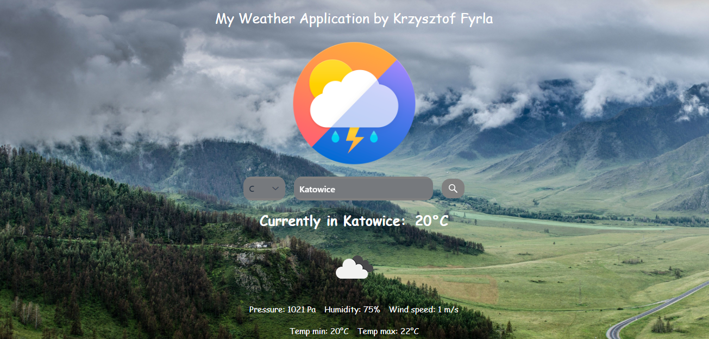

# My Weather App

My Weather App is a simple forecast app, which uses some APIs to fetch forecast data from the OpenWeather.

## Technologies
Project is created with:
* JAVA version 8
* Maven
* Vaadin
* OpenWeather API

## Information
You will find more information:
https://krzysztoffyrla.pl
